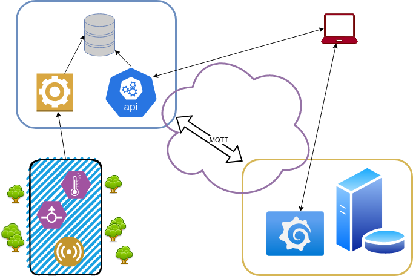

# MASTRO SCADA

Recoge los valores de la red de sensores descrito en ficheros yml.
## Esquema



## Proceso de lectura de dispositivos MODBUS

### Uso de la herramienta:

```bash
usage: mastro_main.py [-h] [-t] [-c] [-m] [-e] [-g]

Mastro Scada: Modbus Process loop

options:
  -h, --help       show this help message and exit
  -t, --test       Test mode
  -c, --config     Show config file
  -m, --modbus     Show modbus map
  -e, --env        Executed with Environment variables
  -g, --generator  Grafana Sql generator
```

## Mapa de sensores

El directorio **/devices** almacena los archivos .yml que permitirán agrupar los dispositivos reflejados en cada uno. El nombre de cada fichero quedará reflejado en la base de datos para su uso en filtros.

### Fichero yml:

**devices:** listado de dispositivos

```yml
devices:
- reference <STR>: Nombre del dispositivo modbus
  modbusid <INT>: Modbus id
  loop <INT>: Número de segundos para lectura periódica
  3x:
    - address: <INT>
    - count <INT>: direcciones a contar empezando por 'address'
    - channels:
      - ch <INT>: número del canal a salvar
        item <STR>: nombre del canal
        unit <STR>: unidad de medida del canal
        const <INT>: constante a multiplicar el valor recibido
        errorcode <INT>: cógigo de error
```

Ejemplo de sensor:

```yml
devices:
- reference: MOXA144
  gateway: 10.130.20.144
  modbusid: 1
  loop: 30
  3x:
    - address: 2048
      count: 16
      channels:
        - ch: 3
          item: TC1
          unit: "ºC"
          const: 0.1
          errorcode: -1
```

## .ENV mastro_pull file configuration

```bash
TIMEZONE=Europe/Madrid

MQTT_INSERT=yes
MQTT_HOST=rabbitmq
MQTT_QUEUE=weather_algete

WATCHDOG=yes
TIMED_WATCHDOG=7200

PGSQL_INSERT=yes
PGSQL_USER=postgres
PGSQL_PASSWORD=timescalespass
PGSQL_HOST=pgtimescale
PGSQL_PORT=5432
PGSQL_DATABASE=weather_algete
PGSQL_MEASUREMENT=weather_v1

#FOLDER_DEVICE=meteo

```

## Detalles de colas en contenedor MQTT
```bash
>alias mq='watch -n 5 rabbitmqctl list_queues name messages_ready messages_unacknowledged'
```

## Crear network para una interfaz de red, entorno docker client
```bash
>docker network create -d macvlan --subnet=10.130.20.20/24 --gateway=<GATEWAY> -o parent=<INTERFAZ> <NETWORK NAME>
```

### Activar la interfaz al inicio (PROBAR)
```bash
>ip link set eth0 up
```

### Ejemplo
```bash
$docker network create -d macvlan --subnet=192.168.127.20/24 --gateway=192.168.127.1 -o parent=enp1s0 mastro_enp1s0
```

# GARAFANA GUI

```sql
/* GRAFANA SQL Dashboard*/

select time, data_value as "Temp" from data_reinvent2labo dt 
inner join channels c on c.channel_id = dt.channel_id
inner join devices d on d.device_id = c.device_id
where d.reference = 'VOC10' and c.item = 'Temp'
```

```sql
/* GRAFANA SQL Relationships*/

SELECT reference, item, measurement, last_access, file, channel, 
concat('SELECT time, data_value AS "', item, '" FROM data_', measurement, ' dt WHERE dt.channel_id = ''', channel_id, ''';') 
as query FROM channels ch INNER JOIN devices d ON ch.device_id = d.device_id
```

```sql
/* GRAFANA SQL Device*/

select to_char(sd."time", 'DD-MM-YYYY HH24:MI:SS') as dtime, concat(sd.data_value, ' ', c.unit) as value, c.item, d.reference from data_reinvent2labo sd
inner join (
	select channel_id, max(time) as time 
	from data_reinvent2labo dr 
	group by channel_id
) sm on sd.channel_id = sm.channel_id
inner join channels c on c.channel_id = sd.channel_id 
inner join devices d on c.device_id = d.device_id
and sm.time = sd."time"
where d.reference = 'VOC10'
```

```sql
/* GRAFANA 15 min. Intervals*/

SELECT time, data_value AS "suelo"
FROM (
  SELECT time, data_value,
         ROW_NUMBER() OVER (PARTITION BY DATE(time) ORDER BY time ASC) AS row_num
  FROM data_biomat_v1 dt 
  WHERE dt.channel_id = '885421b9-14ba-4ae2-bece-638527682105'
) AS filtered_data
WHERE MOD(row_num, 15) = 1;
```

### Comandos desconocidos en DEBIAN

Reconocer comandos: ```PATH=$PATH:/usr/sbin```   
Reconocer .bashrc: ```source ~/.bashrc```

### Evitar la hibernación en equipo DEBIAN

```bash
$sudo systemctl mask sleep.target suspend.target hibernate.target hybrid-sleep.target
```

### PYTEST

```bash
$pytest --cov . --cov-report html -v
```

# POSTGRESQL DATABASE BACKUP and RESTORE into containers

```bash
# Create backup from database to folder named [database]
$docker exec -t [container] pg_dump -U postgres -Fd [database] -j 5 -f /backup/[folder_backup]

# Copy folder backup from container to host
$docker cp [container]:/backup/[folder_backup] .

# Copy folder backup from host to local
$scp -r [user]@[host]:/backup/[folder_backup] .

# Create postgres container
$docker run -d --name timescaledb_backup -p 25432:5432 -e POSTGRES_PASSWORD=password timescale/timescaledb:latest-pg14

# Copy folder backup from local to container
$docker cp [folder_backup] [container]:/backup

# Restore database from folder backup to container
$docker exec -t [container] pg_restore -U postgres -d [database] /backup/[folder_backup]

```


## POSTGRESQL configuration

```bash
$cd /docker-entrypoint-initdb.d
$psql -U postgres

> \l # list databases
> CREATE DATABASE newdb;

$psql -U postgres <newdb>

> \i init.sql
> \dt # list tables
```

### Eliminar valores obsoletos
```sql
$psql -U postgres biomat_testing
$delete from data_[measurement] where time<'[date]';
```